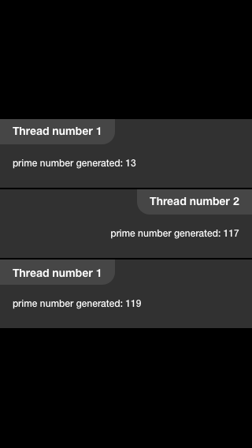

**Test task for Android developer**

_A goal of the task isn’t implementing full logic of the app with detecting minor cases. The main goals are: an overall architecture of app, thread communication design, how code is readable, code style, supposed strategy of error handling, testing and so on._

Create a multi-threaded application that perform calculation of prime numbers and show them in a RecyclerView. 

Minimal supported API is 21.

The app should calculate prime numbers from some intervals specified in xml-based file placed in Asset folder.
The app should perform calculation in several threads that send results to another thread as soon as a few prime numbers have been found. 
Another thread has to be waiting for the prime numbers, pulls them (in order how prime number were found) and sends them for displaying through another thread (storing thread).
The storing thread should be implemented like a fake tcp-socket with states: establish connection, send (save to file) prime numbers at a slow pace, closed connection, reconnection if the opened connection was unexpectedly closed. After receive storing thread display founded prime number in RecyclerView.

Example of input xml file:
```
<root>
  <intervals>
    <interval>
<id>1</id>
<low> 100 </low>
<high> 200</high>
    <interval>
    <interval>
		<id>2</id>
<low> 500</low>
<high> 888</high>
     <interval>
	....
  </intervals>
</root>
```
Parsing xml should be performed without any(Android internal or 3rd  party) library.

`<Id>` field used as thread id for displaying.


Even threads output information on the right side, odd threads - on the left side as shown in the figure.

